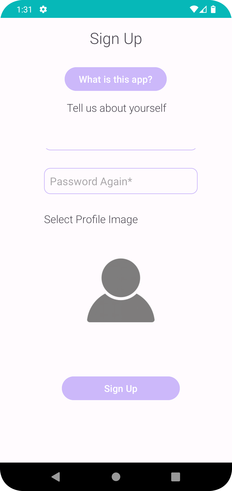
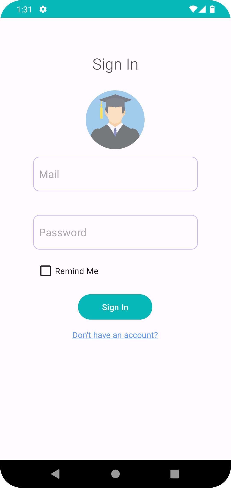
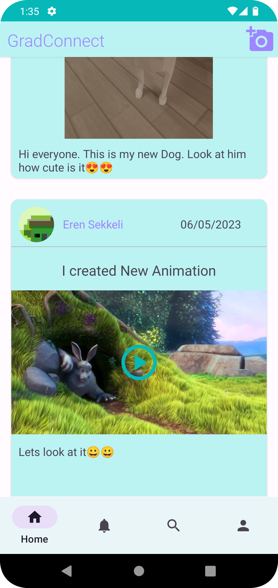
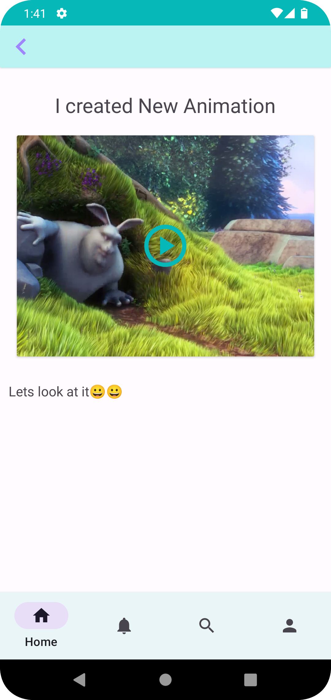
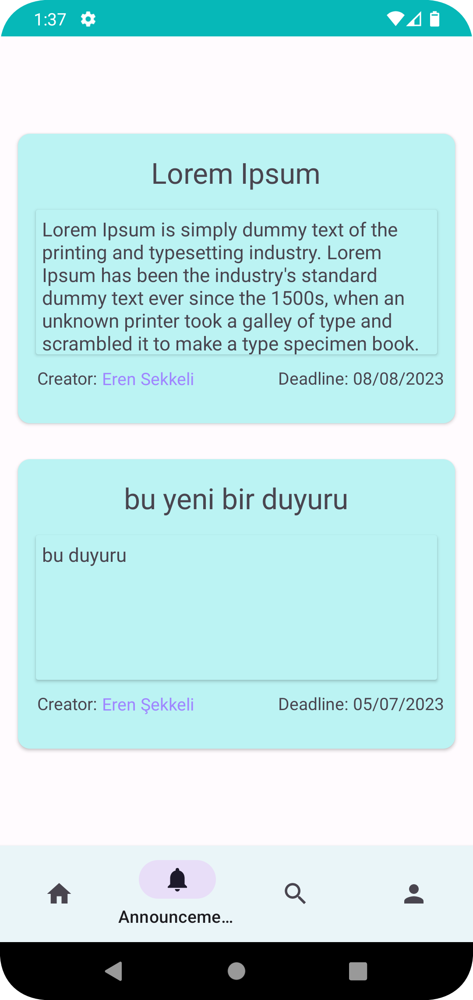
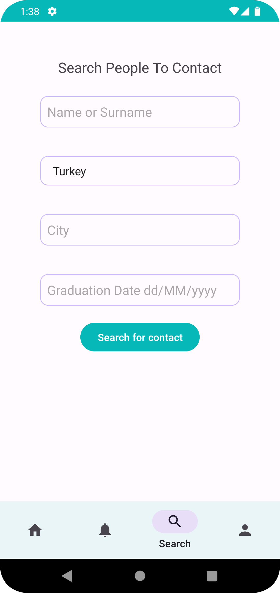
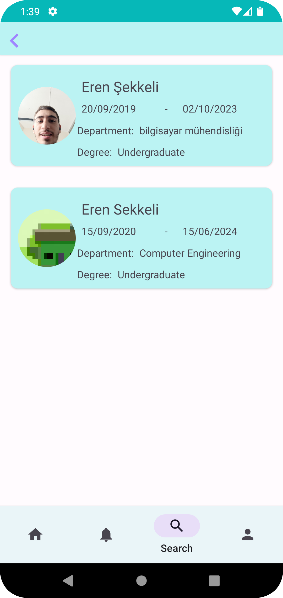
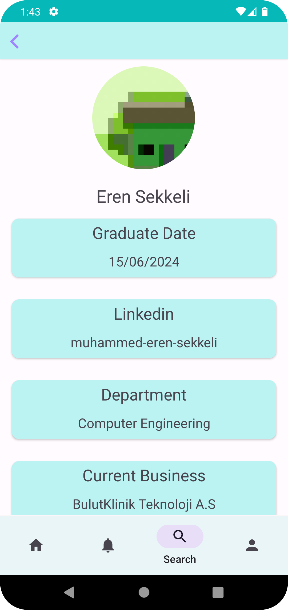
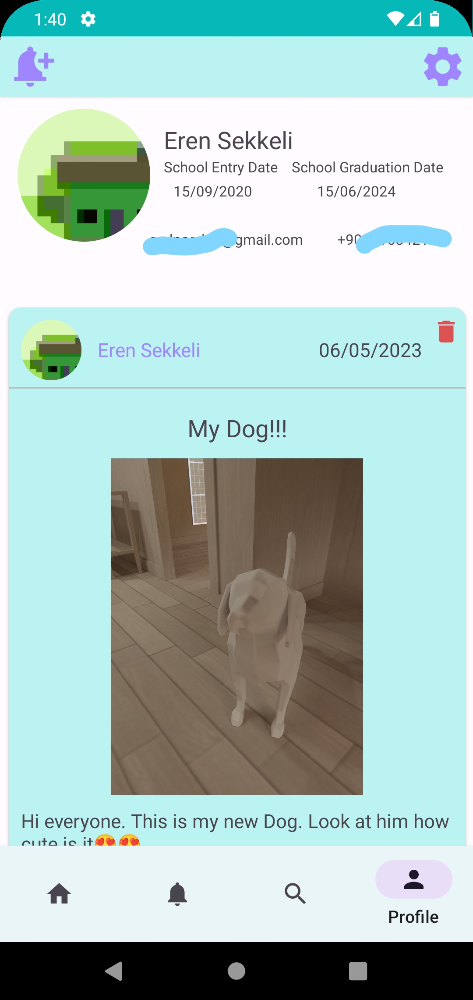

# GradConnect Android Application

## Description
GradConnect is an Android application that allows who graduated from the same university to connect with each other. Users Can create announcements, media like social media and see other user's profiles.

## Used Technologies
- Android Studio
- Kotlin
- Firebase

## Features
- Users can create an account:

- Users can login to the app:

- Users can see media posted by other users:

  
  

- Users can see announcements posted by other users:

- Users can search for other user profiles:

  
  

- Users can see their own profile:

## Installation
- If you want to download the apk file directly, you can download it from [here](gradConnect.apk).

